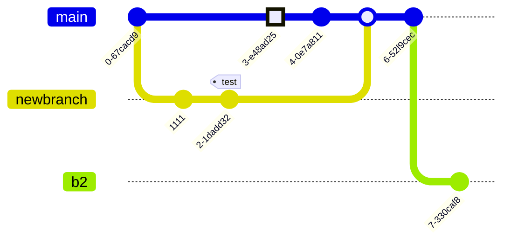

Hey, I am currently open to new work opportunities, you can find my resume [here](https://github.com/p-balu/resume/blob/main/resume_balachander-4.pdf?raw=true)

# Ghore (GitHub offline renderer)


## Content

- [What is this?](#what-is-this)
- [Features](#features)
- [Examples](#examples)
- [Requirements](#requirements)
- [Installation](#installation)
- [Installing `package using npm` globally](#installing-package-using-npm-globally)
- [Configuration](#configuration)
- [Contributing](#contributing)
- [License](#license)

# What is this?

Ghore is an open-source, offline command-line interface (CLI) tool specifically designed for developers and writers working with GitHub. Its primary function is to render Markdown files into HTML, closely emulating the GitHub Markdown style. This enables users to preview how their Markdown documents will look on GitHub before committing them to a repository.

## Features

- **Offline Conversion:** Convert Markdown files to HTML offline without the need for an internet connection.
- **Watch for Changes:** Automatically update the HTML output when changes are made to the input Markdown file.
- **GitHub Styling:** HTML output mirrors the GitHub Markdown style for consistency.
- **Code Block Highlighting:** Integrated [Starry Night](https://github.com/your-username/starry-night) ensures beautiful and syntax-highlighted code blocks.
- **Flowchart Support:** It also supports live preview of mermaid code blocks (Github's API doesn't process mermaid codeblocks).

## `Examples`

Highlights the below code block function using integrated [Starry Night](https://github.com/your-username/starry-night)

````code
    ```sh
    // Highlight code blocks function
const highlightCode = async (lang, str) => {
  if (!starryNight || !toHtml) {
    await initializeStarryNight();
  }
    ```
````

#### like this

```sh
const highlightCode = async (lang, str) => {
  if (!starryNight || !toHtml) {
    await initializeStarryNight();
  }
```

Below mermaid block will be diplayed

````code

````

#### like this



## `Requirements`

Requires the latest version of nodejs 20.10.0 or above.

## `Installation`

```bash
# Clone the repository
git clone https://github.com/p-balu/ghore.git

# Navigate to the project directory
cd ghore

# Install dependencies
npm install

#To start the application locally
npm start `your/filepath/README.md`
```

## Installing `package using npm` globally

Install the package globally

```sh
npm i ghore -g
```

### Start the application in 2 different ways

If you are already inside the directory where README.md file exists then run

```bash
ghore preview
```

#### or

```sh
ghore preview /path/toyour/README.md
```

## Configuration

You can customize the appearance of the HTML output by modifying the included CSS file (`styles.css`).

## Contributing

Contributions are welcome! Feel free to open issues, submit pull requests, or provide feedback.

## License

This project is licensed under the [MIT License](LICENSE).
